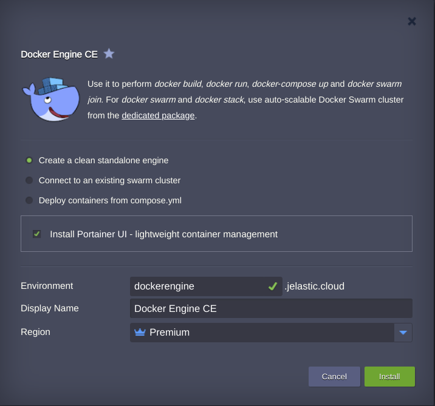
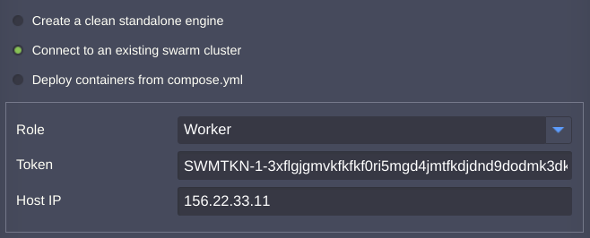
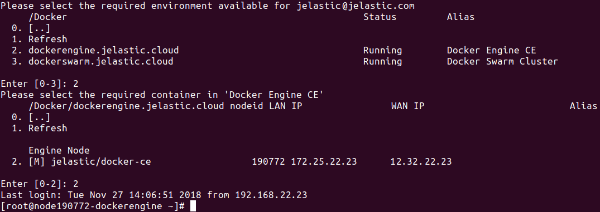

# Docker Engine

The package for automatic installation of Docker Engine (CE) as a standalone node or a swarm member.

## What is Docker Engine Package

The **Docker Engine** package by Jelastic creates an [isolated worker node](https://docs.docker.com/engine/swarm/how-swarm-mode-works/nodes/) with the Docker Community Edition (CE) engine being run inside, which is someway similar to launching it within a separate virtual machine (VM). Herewith, the Platform additionally provides [automatic vertical scaling](https://docs.jelastic.com/automatic-vertical-scaling) for all such worker nodes, allowing to pay only for the actually used capacities regardless of the stated resources limits. 

The current solution proposes several deployment options, allowing to run a new Engine server as either:
* _a standalone ‘clean’ Docker container_ with an optional Portainer management GUI integration
* _a node with pre-deployed application_, which is automatically installed just upon an instance creation based on the specified compose file
* _a swarm member_, providing an automatic node’s integration to the already existing Docker Swarm cluster using the appropriate _[join token](https://docs.docker.com/engine/swarm/join-nodes/#join-as-a-worker-node)_ hash

## Docker Engine Installation

Log into your Jelastic account and [import](https://docs.jelastic.com/environment-import) link to the _manifest.jps_ within this repo root (this package is also delivered through [Jelastic Marketplace](https://docs.jelastic.com/marketplace)):

Here, you need to provide some details on the desired Docker Engine environment parameters:
* choose the preferred installation type
  * _**Create a clean standalone engine**_ - to integrate the newly created Engine container into the already run Docker Swarm with either _Manager_ or _Worker_ role, through providing the appropriate cluster _Join Token_ and _Host IP_

  

  * _**Connect to an existing swarm cluster**_ - to automatically include the newly created Docker Engine container into the existing Docker Swarm cluster (with either Manager or Worker role) through providing the appropriate cluster _Join Token_ and _Host IP_

 

  * _**Deploy containers from compose.yml**_ - to set up an engine node with the automatically deployed application from the specified custom repository

 

* **Environment** - type a name for your environment
* **Display Name** - optionally, specify an [environment alias](https://docs.jelastic.com/environment-aliases) for its better differentiation within the Jelastic dashboard and [SSH Gate](https://docs.jelastic.com/ssh-gate)

Click **Install** and wait a few minutes for Jelastic to automatically perform all the required configurations.

## Operating with Your Docker Engine Node

The Docker Engine node could be connected to and managed in the following ways, available by default:

### Portainer UI

In case you’ve defined to install the Portainer UI when setting up a bare Engine instance, the appropriate management panel can be accessed by simply opening your environment URL in a browser through HTTPS. 

> **Note:** By default, connection to Portainer is secured with a [self-signed SSL certificate](https://docs.jelastic.com/self-signed-ssl), thus you might be shown the warning that it’s not trusted by your browser. This does not actually affects the Portainer functionality - you just need to confirm you do want to access the requested page. 
> 
> 

> 
> The required for that actions could differ depending on a used browser - for example, in Mozilla you have just press **Add Exception** and in Google Chrome you’ll need to expand the **Advanced** section and click on the **_Proceed to {env_URL}_** link.

The appropriate authentication credentials to enter the Portainer itself can be found within the corresponding email notification you’ve received during the Engine server creation.

### SSH Gate

To start working over Jelastic SSH Gate - just [connect](https://docs.jelastic.com/ssh-access) to your account, choose an environment with your Docker Engine node and refer to the appropriate topology layer & container.

## Requirements

Before installing the package, please consider the following points:
* The appropriate Platform should run Jelastic of [5.2 version or later](https://jelastic.cloud/?versions=5.3_5.2) with the Native Dockers support enabled (i.e. it should contain an [environment region](https://docs.jelastic.com/environment-regions) with [Virtuozzo 7](https://virtuozzo.com/products/virtuozzo/) virtualization being integrated - the appropriate hardware set name(s) could be found within the dedicated column of the [Jelastic Hosting Providers](https://docs.jelastic.com/jelastic-hoster-info) list).
* In order to be successfully installed, the Docker Engine requires a [public SSH key](https://docs.jelastic.com/ssh-add-key) being added to your Jelastic account (whilst the corresponding private key should be handled at your local machine).
* The included option of [Public IP](http://docs.jelastic.com/public-ipv4) attachment is usually provided for billing users only, thus you’ll need to convert your account beforehand.
