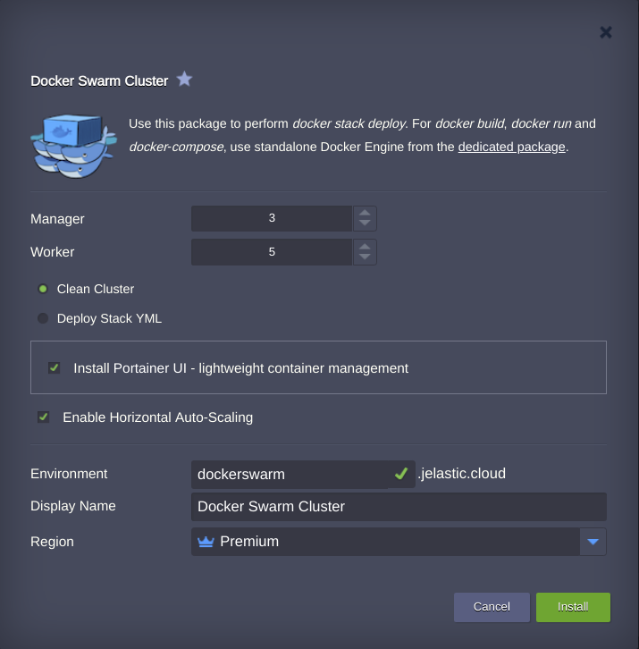

 

Prepackaged Docker Swarm cluster with out-of-box automatic vertical and horizontal scaling.

## What is Docker Swarm Package

A **Swarm** cluster represents a set of [Docker Engine](https://github.com/jelastic-jps/docker-native/tree/master/docker-engine) nodes run in a _swarm_ mode, which constitutes a fault-tolerant platform with built-in cluster management features to keep your dockerized services running and available. Within Jelastic, it is provided as an environment of two layers with the following node roles: 
* [_Manager_](https://docs.docker.com/engine/swarm/how-swarm-mode-works/nodes/#manager-nodes) - maintains the desired state of your swarm and all services running on it
* [_Worker_](https://docs.docker.com/engine/swarm/how-swarm-mode-works/nodes/#worker-nodes) - receives and executes tasks, dispatched from Manager nodes

This automation package creates Docker Swarm cluster with any desired number of automatically scaled _Manager_ and _Worker_ nodes. Also, it includes an additional option to deploy services from a specified [compose file](https://docs.docker.com/compose/compose-file/).

## Auto-Scaling Configuration

The Jelastic Docker Swarm package is preconfigured to automatically adjust the number of included nodes based on current load (up to 10 instances per layer by default) according to the following conditions:
* +1 node if RAM usage is >70% for at least 5 minutes
* -1 node if RAM usage <40% for at least 5 minutes

These modifications are automatically applied to both _Manager_ and _Worker_ environment layers, whilst you receive the appropriate email notification upon each executed scaling operation. Herewith, the minimal count of nodes won’t fall below the values you’ve specified during your Docker Swarm cluster creation.

In case you’d like to tune the default automatic scaling parameters, refer to the appropriate triggers’ settings within the [Automatic Horizontal Scaling](https://docs.jelastic.com/automatic-horizontal-scaling) section.

## Docker Swarm Installation

Log into your Jelastic account and [import](https://docs.jelastic.com/environment-import) link to the _manifest.jps_ file from the repo’s file list above:

Here, you need to specify some details to get the cluster you need:
* **Manager** - number of manager nodes to be included into cluster (with [Public IP](https://docs.jelastic.com/public-ipv4) being automatically attached to each container)
* **Worker** - number of worker nodes to be included into cluster
* choose deployment type:
  - **_Clean Cluster_** - to create a bare cluster; as an extra option, you can simultaneously install the [Portainer](https://portainer.io/) management UI for convenient operating with a cluster

  - **_Deploy Stack YML_** - to perform _[docker stack deploy](https://docs.docker.com/engine/reference/commandline/stack_deploy/)_ alongside with the cluster creation and instantly deploy the required dockerized services by specifying link to the appropriate [compose YML file](https://docs.docker.com/compose/compose-file/):

* **Environment** - type a name for your environment
* **Display Name** - optional [alias](https://docs.jelastic.com/environment-aliases) to be displayed for environment

Click **Install** and wait a few minutes for Jelastic to automatically perform all the required actions.

## Docker Swarm Connection

After the successful installation, your cluster can be accessed in the following ways for further management:

* ### Portainer UI

In case you’ve installed a clean cluster with the Portainer UI, the appropriate management panel can be accessed by simply opening any of your manager nodes in a browser through _HTTPS_.  

> **Note:** By default, connection to Portainer is secured with a [self-signed SSL certificate](https://docs.jelastic.com/self-signed-ssl), thus you might be shown the warning that it’s not trusted by your browser. This does not actually affect the Portainer functionality – you just need to confirm you do want to access the requested page.
> 
> 

> 
> The required for that actions could differ depending on a used browser - for example, in Mozilla you have just press **Add Exception** and in Google Chrome you’ll need to expand the **Advanced** section and click on the **_Proceed to {env_URL}_** link.

The appropriate authentication credentials to enter the Portainer itself can be found within the corresponding email notification you’ve received during the Docker swarm creation.

* ### SSH Gate

Use Jelastic SSH Gate - just [connect](https://docs.jelastic.com/ssh-access) to your account and choose one of the _Manager_ nodes within your Docker swarm environment to start managing the whole cluster.

> **Tip:** Also, starting with the 5.4 Jelastic release, you can establish an SSH connection to the required container directly via your browser by clicking on the **Web SSH** option next to it at the dashboard.
> 
> 

## Requirements

Before installing the package, please consider the following points:

* The chosen Platform should run Jelastic of [5.2 version or later](https://jelastic.cloud/?versions=5.3_5.2) and contain environment region(s) with native Docker container support enabled (their presence and names could be found within the same-named column of the [Jelastic Hosting Providers](https://docs.jelastic.com/jelastic-hoster-info) list).
* The included option of [Public IP](http://docs.jelastic.com/public-ipv4) attachment is provided for billing users only, thus you need to convert your account beforehand.

